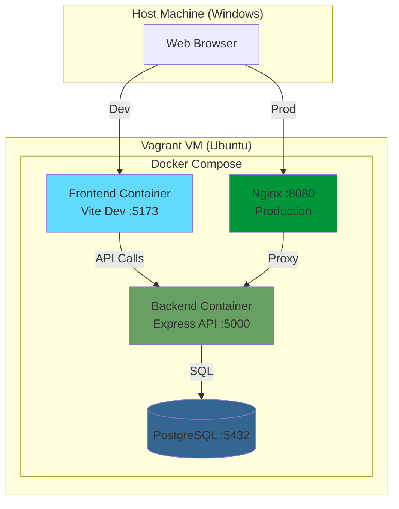

# Focus-Lite 🧠✅

Focus-Lite is a **full-stack task management application** built to demonstrate clean backend architecture, modern frontend practices, and professional DevOps workflows.

This project is intentionally opinionated and development-focused: everything runs locally via **Vagrant + Docker**, with CI quality gates (tests, linting, Sonar) enforcing discipline.

---

## ✨ Features

- User registration & login (JWT authentication)
- Protected task management
  - Create, list, update status, delete tasks
- Server-side validation + database constraints
- Pagination-ready API
- React frontend with protected routes
- Fully containerised dev environment
- Automated tests, linting, and quality gates

---

## 🧱 Tech Stack

### Backend

- Node.js (ES modules)
- Express
- PostgreSQL
- JWT authentication
- Jest + Supertest
- ESLint

### Frontend

- React
- React Router
- Axios
- Vite
- ESLint (React + hooks)

### DevOps / Infra

- Vagrant (Ubuntu VM)
- Docker & Docker Compose
- GitHub Actions (CI)
- SonarCloud (quality gate)

---

## Screenshots


---

## 🚀 Quick Start

### Prerequisites

- [Vagrant](https://www.vagrantup.com/) (2.2+)
- [VirtualBox](https://www.virtualbox.org/) (6.1+)
- 4GB RAM available for VM
- 10GB disk space

### Setup (First Time)

```bash
# 1. Clone the repository
git clone https://github.com/KagisoKat/focus-lite.git
cd focus-lite

# 2. Start Vagrant VM (this will take 5-10 minutes first time)
vagrant up

# 3. SSH into the VM
vagrant ssh

# 4. Inside VM: Start Docker services
cd /vagrant
docker-compose up -d

# 5. Run database migrations
docker-compose exec backend npm run migrate

# 6. Optional: Seed test data
docker-compose exec -T db psql -U focus_user -d focus < backend/src/db/seeds/001_seed.sql
```

### Access the Application

- **Frontend (Dev)**: http://localhost:5173
- **Backend API**: http://localhost:5000
- **Production Build**: http://localhost:8080 (after running `make prod`)
- **Database**: localhost:5433 (PostgreSQL)

### Development Workflow

```bash
# Start services
vagrant ssh
cd /vagrant
docker-compose up

# Run tests
docker-compose exec backend npm test
docker-compose exec backend npm run test:cov

# Run linting
docker-compose exec backend npm run lint
docker-compose exec frontend npm run lint

# View logs
docker-compose logs -f backend
docker-compose logs -f frontend

# Stop services
docker-compose down

# Rebuild after dependency changes
docker-compose build --no-cache backend
docker-compose build --no-cache frontend
```

### Production Build

```bash
# Build and start production containers
make prod

# Or manually:
docker-compose -f docker-compose.prod.yml up --build
```

---

## 🧪 Testing

### Backend Tests

```bash
# Run all tests
docker-compose exec backend npm test

# Run with coverage
docker-compose exec backend npm run test:cov

# Run specific test file
docker-compose exec backend npm test auth.test.js
```

Test suites include:

- ✅ Authentication (register, login)
- ✅ Task CRUD operations
- ✅ Negative cases (error handling)
- ✅ Health endpoint

### Frontend Tests

```bash
# Run frontend tests
docker-compose exec frontend npm test
```

---

## 📊 Code Quality

### Linting

```bash
# Backend linting
docker-compose exec backend npm run lint

# Frontend linting
docker-compose exec frontend npm run lint
```

### SonarCloud

Code quality analysis runs automatically on every PR via GitHub Actions.

- **Quality Gate**: Must pass before merging
- **Coverage**: Tracked via lcov reports
- **Configuration**: [sonar-project.properties](sonar-project.properties)

---

## 📚 Documentation

- **[Architecture Details](docs/architecture-diagram.md)** - System design and data flows
- **[Lessons Learned](docs/LESSONS_LEARNED.md)** - Development insights and best practices
- **[API Reference](#-api-reference)** - Endpoint documentation (below)

---

## 🏗️ Architecture

Focus-Lite uses a containerized architecture with separate services for frontend, backend, and database.



📖 **[View detailed architecture documentation](docs/architecture-diagram.md)**

---

## 90-second demo script

1. "This is Focus-Lite: a task manager built with a PERN stack and DevOps-quality workflows."
2. "Auth is JWT-based: register/login, then protected routes."
3. "Tasks support create, inline edit, status updates, delete — all with optimistic UI + rollback."
4. "The UI has dark mode, skeleton loaders, and toast notifications for feedback."
5. "Quality gates: Jest + Supertest tests, ESLint, coverage publishing, and SonarCloud analysis on every PR."
6. "Production mode uses Nginx as the front door serving the built SPA and proxying /api to the backend, with automated DB migrations."

---

## 📁 Project Structure

```text
focus-lite/
├─ Vagrantfile
├─ docker-compose.yml
├─ Makefile
├─ README.md
├─ sonar-project.properties
│
├─ backend/
│  ├─ Dockerfile
│  ├─ package.json
│  ├─ src/
│  │  ├─ app.js
│  │  ├─ index.js
│  │  ├─ config/
│  │  ├─ controllers/
│  │  ├─ routes/
│  │  ├─ middleware/
│  │  ├─ utils/
│  │  └─ db/
│  │     ├─ migrations/
│  │     └─ seeds/
│  └─ test/
│
├─ frontend/
│  ├─ Dockerfile
│  ├─ package.json
│  └─ src/
│     ├─ api/
│     ├─ components/
│     ├─ pages/
│     └─ styles/
```

---

## 📖 API Reference

### Authentication

**POST /api/auth/register**

- Body: `{ email, password }`
- Success: `201` with `{ ok: true, message }`
- Errors: `409` (duplicate email), `422` (validation failed)

**POST /api/auth/login**

- Body: `{ email, password }`
- Success: `200` with `{ ok: true, token }`
- Errors: `401` (invalid credentials), `422` (validation failed)
- Rate limit: 50 requests per 15 minutes per IP

### Tasks (Protected)

All task endpoints require: `Authorization: Bearer <token>`

**GET /api/tasks**

- Success: `200` with `{ ok: true, tasks: [...] }`
- Errors: `401` (missing/invalid token)

**POST /api/tasks**

- Body: `{ title }`
- Success: `201` with `{ ok: true, task: {...} }`
- Errors: `401`, `422` (empty title)

**PATCH /api/tasks/:id**

- Body: `{ title?, status? }` (one or both)
- Status values: `pending`, `in-progress`, `completed`
- Success: `200` with `{ ok: true, task: {...} }`
- Errors: `401`, `404` (task not found), `422` (invalid status)

**DELETE /api/tasks/:id**

- Success: `200` with `{ ok: true, message }`
- Errors: `401`, `404` (task not found)

---

## 🔒 Security

- **JWT Expiry**: Tokens expire after 7 days
- **Password Hashing**: bcrypt with cost factor 12
- **Rate Limiting**: Auth endpoints limited to 50 requests per 15 minutes per IP
- **CORS**: Configured for `http://localhost:5173` (dev) and production origin
- **Helmet**: Security headers enabled in production
- **Validation**: Server-side validation on all inputs with explicit error messages

---

## 🤝 Contributing

This is a portfolio/learning project, but suggestions are welcome!

1. Fork the repository
2. Create a feature branch (`git checkout -b feature/amazing-feature`)
3. Commit your changes (`git commit -m 'Add amazing feature'`)
4. Push to the branch (`git push origin feature/amazing-feature`)
5. Open a Pull Request

All PRs must:

- Pass all tests
- Pass linting checks
- Pass SonarCloud quality gate
- Include relevant test coverage

---

## 📝 License

This project is licensed under the MIT License - see the LICENSE file for details.

---

## 👤 Author

**Kagiso Manamela**

- GitHub: [@KagisoKat](https://github.com/KagisoKat)
- LinkedIn: [Connect with me](https://linkedin.com/in/your-profile)

---

## 🙏 Acknowledgments

- Inspired by modern full-stack best practices
- Built with guidance from Node.js and React communities
- DevOps patterns from industry-standard workflows

---

## 📖 Additional Resources

- [Lessons Learned](docs/LESSONS_LEARNED.md) - Development journey insights
- [Architecture Diagram](docs/architecture-diagram.md) - Technical deep dive
- [CHANGELOG](CHANGELOG.md) - Version history

---

**Version**: 1.0.0  
**Status**: ✅ Production Ready  
**Last Updated**: January 2026
