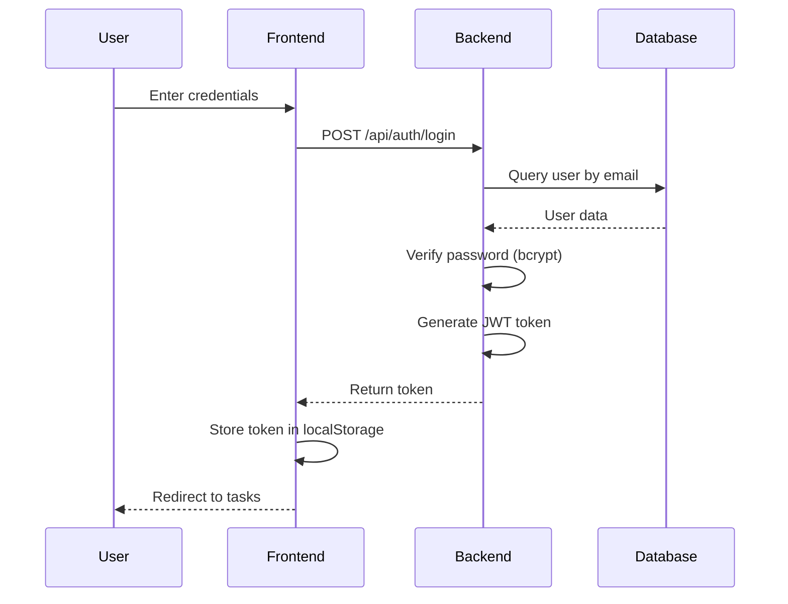
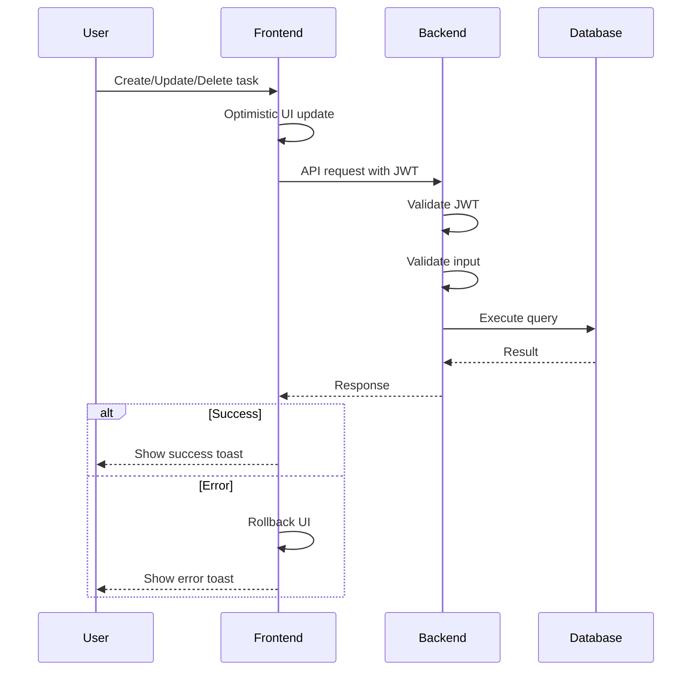
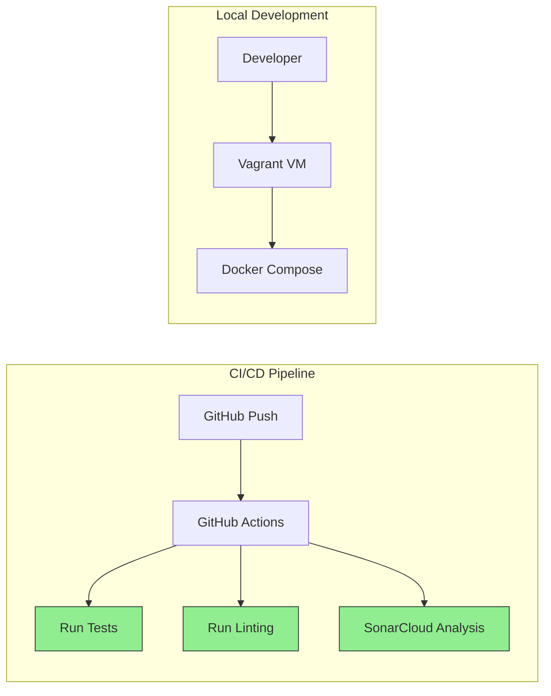

# Focus-Lite Architecture

## System Overview

```mermaid
graph TB
    subgraph "Host Machine (Windows)"
        Browser[Web Browser]
        Vagrant[Vagrant CLI]
    end

    subgraph "Vagrant VM (Ubuntu)"
        subgraph "Docker Compose"
            Frontend[Frontend Container<br/>Vite Dev Server<br/>Port 5173]
            Backend[Backend Container<br/>Node.js + Express<br/>Port 5000]
            Database[(PostgreSQL<br/>Port 5432)]
            Nginx[Nginx Container<br/>Production Proxy<br/>Port 8080]
        end
    end

    Browser -->|Dev: localhost:5173| Frontend
    Browser -->|Prod: localhost:8080| Nginx
    Frontend -->|API Calls| Backend
    Nginx -->|/api/*| Backend
    Nginx -->|Static Files| Frontend
    Backend -->|SQL Queries| Database
    Vagrant -->|Manages| "Docker Compose"

    style Frontend fill:#61dafb,stroke:#333,stroke-width:2px
    style Backend fill:#68a063,stroke:#333,stroke-width:2px
    style Database fill:#336791,stroke:#333,stroke-width:2px
    style Nginx fill:#009639,stroke:#333,stroke-width:2px
```

## Component Details

### Frontend (React + Vite)

- **Technology**: React 18, Vite, React Router
- **Port**: 5173 (dev), served by Nginx in prod
- **Features**:
  - JWT-based authentication
  - Protected routes
  - Task management UI
  - Dark mode support
  - Optimistic UI updates
  - Toast notifications

### Backend (Node.js + Express)

- **Technology**: Node.js 20, Express, JWT
- **Port**: 5000
- **Features**:
  - RESTful API
  - JWT authentication middleware
  - Rate limiting
  - Input validation
  - Error handling
  - Database migrations

### Database (PostgreSQL)

- **Technology**: PostgreSQL 16
- **Port**: 5432 (mapped to 5433 on host)
- **Features**:
  - User authentication
  - Task storage with status tracking
  - Indexes for performance
  - Database constraints

### Infrastructure

- **Vagrant**: VM orchestration
- **Docker Compose**: Container orchestration
- **Nginx**: Production reverse proxy
- **GitHub Actions**: CI/CD pipeline
- **SonarCloud**: Code quality analysis

## API Endpoints

### Authentication

- `POST /api/auth/register` - User registration
- `POST /api/auth/login` - User login

### Tasks (Protected)

- `GET /api/tasks` - List user tasks (with pagination)
- `POST /api/tasks` - Create new task
- `PATCH /api/tasks/:id` - Update task
- `DELETE /api/tasks/:id` - Delete task

### Health

- `GET /health` - Health check endpoint

## Data Flow

### Authentication Flow



### Task Operations Flow



## Development vs Production

### Development Mode

- Frontend: Vite dev server with HMR (Hot Module Replacement)
- Backend: Nodemon for auto-restart on changes
- Direct API calls from frontend to backend
- Ports: 5173 (frontend), 5000 (backend), 5432 (database)

### Production Mode

- Frontend: Static build served by Nginx
- Backend: Node.js in production mode
- Nginx reverse proxy for API routing
- Single entry point on port 8080
- Optimized builds and caching

## Security Features

1. **Authentication**: JWT tokens with 7-day expiration
2. **Password Hashing**: bcrypt with salt rounds
3. **Rate Limiting**: Express rate limiter on auth endpoints
4. **Input Validation**: Server-side validation for all inputs
5. **CORS**: Configured for allowed origins
6. **Helmet**: Security headers middleware
7. **SQL Injection Prevention**: Parameterized queries
8. **XSS Prevention**: Content Security Policy headers

## Deployment Architecture



## Quality Gates

- **Unit Tests**: Jest + Supertest for API testing
- **Integration Tests**: Full auth and task workflows
- **Linting**: ESLint for code quality
- **Coverage**: Test coverage reporting
- **Code Analysis**: SonarCloud for code smells and vulnerabilities
- **CI**: Automated checks on every PR

## Scalability Considerations

- Database indexes on frequently queried columns
- Pagination support for task listings
- Stateless backend (horizontal scaling ready)
- Connection pooling for database
- Rate limiting to prevent abuse
- Optimistic UI for better perceived performance
